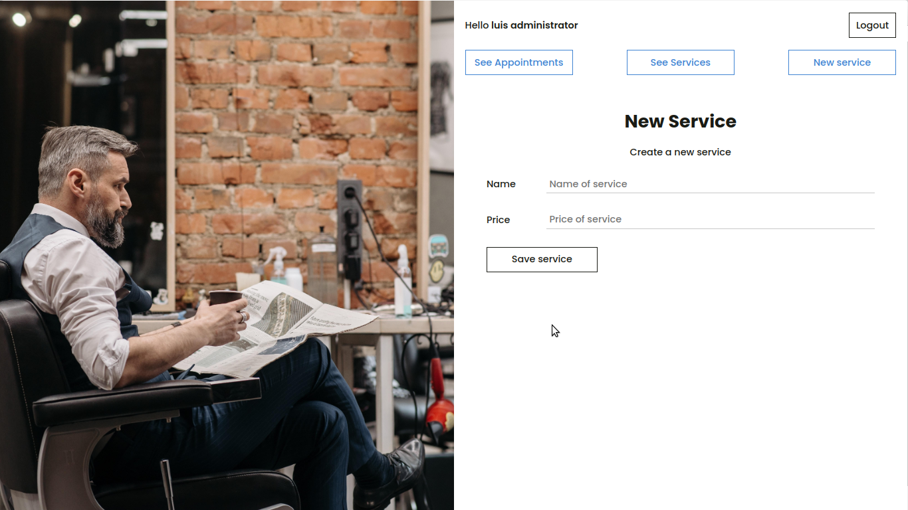

# App_Barber
You can see the app on https://desolate-eyrie-96468.herokuapp.com/
# Technologies
PHP8 
SASS
HTML5
JAVASCRIPT 

# Pictures
## Home app 
This is the home app, only person with an ccount can entry, if you dont confirm your account you cant entry.
NOT SUPPORT FOR CREATE AN ACCOUNT, for security the app is using mailtrap, so a real EMAIL can't be send.

# Customer View
## Services
In this view you can choose your service, for a new reservation

## Reservation
In this site, you only can choose form Monday until Friday, not in weekend
With the hour is the same, only available from 9 am until 18 pm.

## Complete data
If you dont entry all the necesarry data, or just set an incorrect data, you can't set a new reservation

If all the data is correct, the app creates a new reservation and tells you if it is correct

When you set your reservation, a message will appear on screen, 3 seconds late redirects to home for another reservation

#  Admin View

If you a re an admin, you can see any date for an appointment, default, the app shows the present day, if are reservation it shows you, else show a message.
You can navigate for different dates.

## Chane services
An admin can update a data service or delete any service.

## New services
An admin can create a new service with the correctly data

